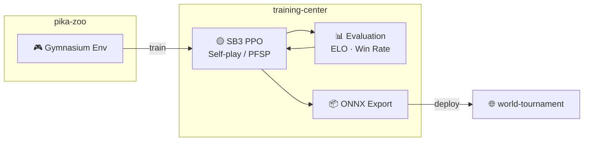

# training-center

[](https://www.python.org/)

RL training pipeline for [alphachu-volleyball](https://github.com/alphachu-volleyball) — self-play, evaluation, and model export.

## Overview

Trains Pikachu Volleyball AI agents using [pika-zoo](https://github.com/alphachu-volleyball/pika-zoo) environments with [Stable-Baselines3](https://stable-baselines3.readthedocs.io/) PPO.

- **Training**: PPO with self-play and PFSP (Prioritized Fictitious Self-Play)
- **Evaluation**: ELO rating and win-rate tracking
- **Export**: ONNX models for browser-based play in [world-tournament](https://github.com/alphachu-volleyball/world-tournament)

### Pipeline



## Quick Start

```bash
# Install
uv sync

# Run tests
uv run pytest

# Lint
uv run ruff check .
```

## Usage

```bash
# Single-agent PPO training (vs builtin AI)
uv run tc-train-ppo --opponent builtin --timesteps 1000000

# Self-play training with PFSP
uv run tc-train-selfplay --total-iterations 100 --steps-per-iter 20000 --save-dir experiments/001

# Round-robin ELO evaluation
uv run tc-evaluate --players random,builtin,models/checkpoints/p1/ppo --games 50
```

## Experiment Tracking

Each training run automatically records git commit hash and pika-zoo version to W&B / TensorBoard for reproducibility.

## Development

See [CLAUDE.md](CLAUDE.md) for the full development guide.

### Branch Workflow

```
feat/* ──(squash)──► main
```

## Related Projects

- [alphachu-volleyball/pika-zoo](https://github.com/alphachu-volleyball/pika-zoo) — Pikachu Volleyball RL environment
- [alphachu-volleyball/world-tournament](https://github.com/alphachu-volleyball/world-tournament) — Web demo (planned)
