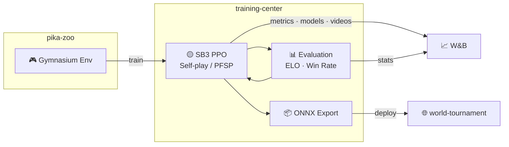

# training-center

[](https://www.python.org/)

RL training pipeline for [alphachu-volleyball](https://github.com/alphachu-volleyball) — self-play, evaluation, and model export.

## Overview

Trains Pikachu Volleyball AI agents using [pika-zoo](https://github.com/alphachu-volleyball/pika-zoo) environments with [Stable-Baselines3](https://stable-baselines3.readthedocs.io/) PPO.

- **Training**: PPO with self-play and PFSP (Prioritized Fictitious Self-Play)
- **Evaluation**: ELO rating and win-rate tracking
- **Export**: ONNX models for browser-based play in [world-tournament](https://github.com/alphachu-volleyball/world-tournament)

### Pipeline



## Quick Start

```bash
# Install
uv sync

# Run tests
uv run pytest

# Lint
uv run ruff check .
```

## Usage

```bash
# Baseline PPO training (vs builtin AI)
uv run train-baseline --opponent builtin --timesteps 1000000

# Self-play training with PFSP
uv run train-selfplay --total-iterations 100 --steps-per-iter 20000 --save-dir experiments/001

# Round-robin ELO evaluation (p1 pool × p2 pool)
uv run evaluate --p1 random,builtin,experiments/001/model --p2 random,builtin,experiments/003/model --games 50
```

## Experiment Tracking

Each training run automatically records git commit hash and pika-zoo version to [W&B](https://wandb.ai/) for reproducibility.

```bash
# First time: log in to W&B (requires API key from https://wandb.ai/authorize)
uv run wandb login

# Runs are logged to --wandb-entity / --wandb-project (defaults: ootzk / alphachu-volleyball)
# To log to your own workspace:
uv run train-baseline --wandb-entity your-entity --wandb-project your-project ...

# Optionally name your run:
uv run train-baseline --wandb-run-name 001-baseline-p1-builtin ...
```

### Tracked Metrics

**round** = serve → score (1 point), **game** = first to winning_score (multiple rounds)

> [!IMPORTANT]
> All models are evaluated on their **training side**. `SimplifyObservation` mirrors player_2's x-axis so both sides see a left-side perspective, but the underlying physics engine has [intentional left-right asymmetries](https://github.com/alphachu-volleyball/pika-zoo#physics-engine-left-right-asymmetry) that make cross-side transfer imperfect. The evaluate script takes separate `--p1`/`--p2` pools to ensure correct placement.

#### Baseline Evaluation (`eval/vs_{opp}/`)

Model is always evaluated on its **training side** (`--side`).
`{opp}`: `random`, `builtin`

| Metric | Range | Description |
|--------|-------|-------------|
| `eval/vs_{opp}/win_rate` | 0–1 | Win rate over eval games |
| `eval/vs_{opp}/avg_score` | 0–5 | Average model score per game |
| `eval/vs_{opp}/serve_win_rate` | 0–1 | Scoring rate when model serves |
| `eval/vs_{opp}/receive_win_rate` | 0–1 | Scoring rate when opponent serves |
| `eval/vs_{opp}/avg_round_frames` | > 0 | Mean frames per round (25 FPS) |
| `eval/vs_{opp}/std_round_frames` | ≥ 0 | Std of round duration (low = repetitive pattern) |
| `eval/vs_{opp}/action_entropy` | 0–log₂18 | Shannon entropy of action distribution |
| `eval/vs_{opp}/power_hit_rate` | 0–1 | Power hits / ball touches |
| `eval/vs_{opp}/ball_own_side_ratio` | 0–1 | Fraction of frames ball is on model's court half |
| `eval/vs_{opp}/serve_avg_round_frames` | > 0 | Mean round frames when model serves |
| `eval/vs_{opp}/receive_avg_round_frames` | > 0 | Mean round frames when opponent serves |
| `eval/elo` | ~1000–2000 | ELO rating across all opponents (baseline 1500) |

#### Self-play Evaluation (`{p1,p2}/eval/`)

p1 model is always evaluated as player_1 (left), p2 as player_2 (right).
`{opp}`: `p2`/`p1`, `random`, `builtin`

| Metric | Description |
|--------|-------------|
| `{p1,p2}/eval/vs_{opp}/win_rate` | Win rate per side per opponent |
| `{p1,p2}/eval/vs_{opp}/avg_score` | Average score per game |
| `{p1,p2}/eval/vs_{opp}/serve_win_rate` | Scoring rate when model serves |
| `{p1,p2}/eval/vs_{opp}/receive_win_rate` | Scoring rate when opponent serves |
| `{p1,p2}/eval/vs_{opp}/avg_round_frames` | Mean frames per round |
| `{p1,p2}/eval/vs_{opp}/std_round_frames` | Std of round duration |
| `{p1,p2}/eval/vs_{opp}/action_entropy` | Shannon entropy of action distribution |
| `{p1,p2}/eval/vs_{opp}/power_hit_rate` | Power hits / ball touches |
| `{p1,p2}/eval/vs_{opp}/ball_own_side_ratio` | Fraction of frames ball on model's half |
| `{p1,p2}/eval/vs_{opp}/serve_avg_round_frames` | Mean round frames when model serves |
| `{p1,p2}/eval/vs_{opp}/receive_avg_round_frames` | Mean round frames when opponent serves |
| `{p1,p2}/pfsp/avg_pool_win_rate` | Average win rate against PFSP pool |
| `{p1,p2}/pfsp/pool_size` | Number of checkpoints in opponent pool |
| `{p1,p2}/curriculum/builtin_prob` | Current builtin AI sampling probability |

#### Training Metrics (SB3 PPO)

| Metric | Description |
|--------|-------------|
| `train/loss` | PPO total loss |
| `train/entropy_loss` | Policy entropy (lower = more deterministic) |
| `train/explained_variance` | Value function accuracy (1.0 = perfect) |
| `train/approx_kl` | KL divergence between old and new policy |

#### Run Config (auto-recorded)

| Field | Description |
|-------|-------------|
| `commit` | Git HEAD hash |
| `dirty` | Uncommitted changes exist |
| `pika_zoo_version` | Pinned pika-zoo version |

## W&B MCP Server (Claude Code Integration)

Claude Code can query W&B experiment data directly via the [wandb-mcp-server](https://github.com/wandb/wandb-mcp-server). Create `.mcp.json` in the project root:

```json
{
  "mcpServers": {
    "wandb": {
      "command": "uvx",
      "args": [
        "--from",
        "git+https://github.com/wandb/wandb-mcp-server.git",
        "wandb_mcp_server"
      ],
      "env": {
        "WANDB_API_KEY": "<your-api-key>"
      }
    }
  }
}
```

Get your API key from https://wandb.ai/authorize.

## Experiment Tips: Cross-machine sync

`experiments/` can be a symlink to a cloud-synced folder (Dropbox, Google Drive, etc.) for sharing experiment data across machines. See [CLAUDE.md](CLAUDE.md#experiments-directory) for setup.

> [!NOTE]
> `experiments/` is gitignored because it contains large model files, temporary outputs, and ad-hoc scripts that change frequently during experimentation.

## Development

See [CLAUDE.md](CLAUDE.md) for the full development guide, including experiment conventions and lessons learned.

### Branch Workflow

```
feat/* ──(squash)──► main
```

## Related Projects

- [alphachu-volleyball/pika-zoo](https://github.com/alphachu-volleyball/pika-zoo) — Pikachu Volleyball RL environment
- [alphachu-volleyball/world-tournament](https://github.com/alphachu-volleyball/world-tournament) — Web demo (planned)
