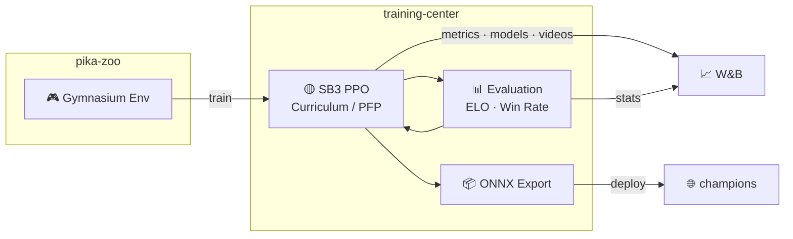

# training-center

[](https://www.python.org/)

RL training pipeline for [alphachu-volleyball](https://github.com/alphachu-volleyball) — curriculum training, evaluation, and model export.

## Overview

Trains Pikachu Volleyball AI agents using [pika-zoo](https://github.com/alphachu-volleyball/pika-zoo) environments with [Stable-Baselines3](https://stable-baselines3.readthedocs.io/) PPO.

- **Training**: PPO with curriculum learning and prioritized fictitious play (PFP)
- **Evaluation**: ELO rating (batch Bradley-Terry MLE) and win-rate tracking
- **Export**: ONNX models for browser-based play in [champions](https://github.com/alphachu-volleyball/champions)

### Pipeline



## Quick Start

```bash
# Install
uv sync

# Run tests
uv run pytest

# Lint
uv run ruff check .
```

## Usage

```bash
# Baseline PPO training (vs builtin AI)
uv run train-baseline --opponent builtin --timesteps 1000000

# Train with pika-zoo frame stacking (obs shape: 35 -> 4x35)
uv run train-baseline --opponent builtin --frame-stack 4 --timesteps 1000000

# Curriculum training (progressive difficulty)
uv run train-curriculum --save-dir experiments/010 --total-iterations 200

# Round-robin ELO evaluation (p1 pool × p2 pool)
uv run evaluate-roundrobin --p1 random,builtin,experiments/001/model --p2 random,builtin,experiments/003/model --games 50

# Compute ELO from existing matchup results (CSV or W&B table JSON)
uv run compute-elo matchups.csv --p1 p1 --p2 p2 --win-rate p1_win_rate --games 100
uv run compute-elo matchups.table.json --p1 p1 --p2 p2 --p1-wins p1_wins --p2-wins p2_wins -o elo.csv

# Export SB3 model to ONNX (outputs model.onnx + model.json)
uv run export-onnx experiments/016/final experiments/016/onnx --name "Alphachu v1"
```

## Training Scripts

### `train-baseline` — Fixed-opponent PPO training

Trains a single agent against a fixed rule-based opponent (random, builtin, stone, duckll). The simplest training mode, useful for bootstrapping a policy before curriculum training.

**Process:**

1. Create `SubprocVecEnv` with N parallel environments, each running the fixed opponent
2. Initialize PPO (or resume from `--init-model`)
3. `model.learn()` runs continuously for `--timesteps` steps
4. `EvalCallback` fires every `--eval-freq` steps during training:
   - Saves a checkpoint to disk
   - Evaluates against each opponent in parallel (`ProcessPoolExecutor`)
   - Computes win rate and detailed metrics → logs to W&B
5. Final evaluation after training completes (guarantees last metrics are logged)
6. Saves final model + records sample videos

**Key design decisions:**

- **SubprocVecEnv** — opponent is fixed, so env parallelization works directly. Each child process runs its own env + opponent independently. This is where multicore CPU gives linear speedup.
- **Frame stacking** — `--frame-stack N` enables pika-zoo's `FrameStack` wrapper after normalization. The saved `model.json` records the stack depth so evaluation, video recording, and ONNX export use the same observation shape.
- **Parallel eval callback** — evaluation matchups are submitted to a `ProcessPoolExecutor` so multiple opponents can be evaluated simultaneously. Models are passed as file paths; workers reconstruct them to avoid pickling issues.
- **SB3 callback-driven eval** — evaluation runs inside the training loop via `EvalCallback`. Training pauses during eval, but parallel execution minimizes the pause.

### `train-curriculum` — Progressive difficulty curriculum training

Trains a single agent against a ladder of increasingly difficult rule-based AIs. Opponents are unlocked as the model masters the current pool.

**Process:**

1. Create `DummyVecEnv` (opponent swapping requires in-process access)
2. Initialize PPO with first few opponents unlocked (stone, random, duckll:1)
3. For each iteration:
   - **Train**: PFP-sample an opponent from unlocked pool, swap policy, `model.learn(steps_per_iter)`
   - **Evaluate** (every `--eval-freq` iters + final): play against all unlocked opponents in parallel
   - **Unlock**: if min win rate across pool >= `--unlock-threshold`, unlock next opponent
4. Saves final model + records sample videos vs all unlocked opponents

**Key design decisions:**

- **CurriculumPool** — manages named AI specs (strings) and optional self-play entries. Uses the PFP weighting formula (`1.0 - win_rate + 0.1`).
- **Unlock-gated ladder** — opponents are ordered by ELO from experiment 009. Only unlocked when all current opponents are mastered. Prevents premature exposure to opponents the model can't learn from.
- **No ELO tracking** — pool composition changes on unlock, making ELO scale unstable. Use `evaluate-roundrobin` after training for absolute ELO measurement.
- **DummyVecEnv** — opponent swapping via `set_opponent_policy()` requires same-process environment access.

### `evaluate-roundrobin` — Round-robin ELO evaluation

Standalone evaluation script for comparing any set of models/AIs in a round-robin format.

**Process:**

1. Build cross-product of p1 pool × p2 pool (including self-matchups)
2. Pre-generate all game seeds for deterministic reproducibility
3. Submit all games to `ProcessPoolExecutor` at once
4. Collect results, compute per-matchup stats and ELO ratings (batch Bradley-Terry MLE)
5. Log as `wandb.Table` for sweep-level comparison

**Key design decisions:**

- **Maximum parallelism** — all games across all matchups are submitted as individual tasks. With hundreds of games and 8+ cores, this gives near-linear speedup.
- **Path-based worker pattern** — workers receive string specs (`"builtin"`, `"duckll:5"`, or model paths), reconstruct `Player` objects internally. This avoids pickling AIPolicy/PPO objects across process boundaries.
- **Deterministic seeding** — seeds are pre-generated from a single RNG in the main process before any parallel execution, ensuring reproducible results regardless of worker scheduling order.

### Common Patterns

Training and evaluation scripts share these conventions:

| Pattern | How |
|---------|-----|
| Model serialization | Pass file paths to workers, `PPO.load()` / `make_player()` inside child process |
| Eval parallelism | `ProcessPoolExecutor` + `as_completed`, results collected in main process |
| Metrics computation | `compute_eval_metrics()` runs inside worker to avoid serializing frame data |
| W&B logging | Always in main process (W&B run is not fork-safe) |
| Reproducibility | Pre-generate seeds from a single RNG, pass to workers |

## Experiment Tracking

Each training run automatically records git commit hash and pika-zoo version to [W&B](https://wandb.ai/) for reproducibility.

```bash
# First time: log in to W&B (requires API key from https://wandb.ai/authorize)
uv run wandb login

# Runs are logged to --wandb-entity / --wandb-project (defaults: ootzk / alphachu-volleyball)
# To log to your own workspace:
uv run train-baseline --wandb-entity your-entity --wandb-project your-project ...

# Optionally name your run:
uv run train-baseline --wandb-run-name 001-baseline-p1-builtin ...
```

### Tracked Metrics

**round** = serve → score (1 point), **game** = first to winning_score (multiple rounds)

> [!IMPORTANT]
> All models are evaluated on their **training side**. `SimplifyObservation` mirrors player_2's x-axis so both sides see a left-side perspective, but the underlying physics engine has [intentional left-right asymmetries](https://github.com/alphachu-volleyball/pika-zoo#physics-engine-left-right-asymmetry) that make cross-side transfer imperfect. The evaluate script takes separate `--p1`/`--p2` pools to ensure correct placement.

#### Evaluation Metrics

Shared across all training scripts. Logged every `--eval-freq` steps/iterations. Eval logging uses one long-form
`wandb.Table` as the source of truth plus one Plotly dashboard.

`{opp}`: `random`, `builtin`, `stone`, `duckll:N`, or `self` when curriculum self-play is enabled

##### Eval Table and Dashboard

Logged by default. `eval/dashboard` is built from `eval/table` in the same log payload, not from summary scalars.
Each eval log rewrites these objects with cumulative rows from the current run so the latest panel shows the full
eval history.

| Key | Columns | Purpose |
|-----|---------|---------|
| `eval/dashboard` | Plotly figure | Dropdown-selected opponent view with win-rate, model score, opponent score, and round-frame subplots together |
| `eval/table` | `step`, `iteration`, `opponent`, `eval_side`, `metric`, `value`, `std`, `ci95_low`, `ci95_high`, `n`, `wins`, `losses` | Single long-form source table for all dashboard curves and uncertainty bands |

`eval_side` is `combined`, `p1`, or `p2`. For single-side models, `combined` is logged as the dashboard's representative
series and is identical to that model's physical side (`p1` or `p2`). `metric` is `win_rate`, `model_score`,
`opponent_score`, `round_frames`, or `game_frames`. `wins`/`losses` are only populated for `win_rate`; `std` is
populated for score/frame metrics.

#### Training Metrics (SB3 PPO)

Logged every iteration (after `model.learn()`) as one compact Plotly panel.

| Metric | Description |
|--------|-------------|
| `train/dashboard` | PPO loss, entropy loss, explained variance, and approx KL. Curriculum runs append pool size and self-play pool size subplots. |

#### One-time Outputs

| Metric | Script | Description |
|--------|--------|-------------|
| `video/samples` | all training | Table of sample game recordings at end of training, grouped by opponent and model side |
| `matchups` (Table) | evaluate-roundrobin | Per-matchup win rates and stats |
| `elo_ratings` (Table) | evaluate-roundrobin | Batch Bradley-Terry ELO ratings |
| `elo/{agent}` (summary) | evaluate-roundrobin | ELO per agent in run summary |

#### Run Config (auto-recorded)

| Field | Description |
|-------|-------------|
| `commit` | Git HEAD hash |
| `dirty` | Uncommitted changes exist |
| `pika_zoo_version` | Pinned pika-zoo version |

## W&B MCP Server (Agent Integration)

Agents can query W&B experiment data directly via the [wandb-mcp-server](https://github.com/wandb/wandb-mcp-server). Create `.mcp.json` in the project root:

```json
{
  "mcpServers": {
    "wandb": {
      "command": "uvx",
      "args": [
        "--from",
        "git+https://github.com/wandb/wandb-mcp-server.git",
        "wandb_mcp_server"
      ],
      "env": {
        "WANDB_API_KEY": "<your-api-key>"
      }
    }
  }
}
```

Get your API key from https://wandb.ai/authorize.

## Experiment Tips: Cross-machine sync

`experiments/` can be a symlink to a cloud-synced folder (Dropbox, Google Drive, etc.) for sharing experiment data across machines. See [AGENTS.md](AGENTS.md#experiments-directory) for setup.

> [!NOTE]
> `experiments/` is gitignored because it contains large model files, temporary outputs, and ad-hoc scripts that change frequently during experimentation.

## Development

See [AGENTS.md](AGENTS.md) for the full development guide, including experiment conventions and lessons learned.

### Branch Workflow

```
feat/* ──(squash)──► main
```

## Related Projects

- [alphachu-volleyball/pika-zoo](https://github.com/alphachu-volleyball/pika-zoo) — Pikachu Volleyball RL environment
- [alphachu-volleyball/champions](https://github.com/alphachu-volleyball/champions) — Web demo (planned)
