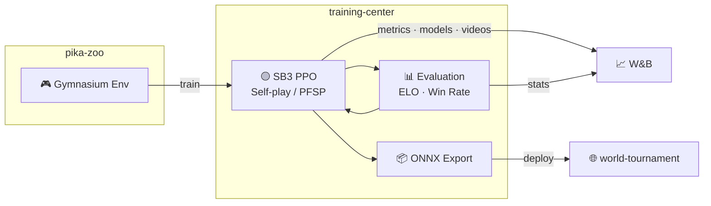

# training-center

[](https://www.python.org/)

RL training pipeline for [alphachu-volleyball](https://github.com/alphachu-volleyball) — self-play, evaluation, and model export.

## Overview

Trains Pikachu Volleyball AI agents using [pika-zoo](https://github.com/alphachu-volleyball/pika-zoo) environments with [Stable-Baselines3](https://stable-baselines3.readthedocs.io/) PPO.

- **Training**: PPO with self-play and PFSP (Prioritized Fictitious Self-Play)
- **Evaluation**: ELO rating and win-rate tracking
- **Export**: ONNX models for browser-based play in [world-tournament](https://github.com/alphachu-volleyball/world-tournament)

### Pipeline



## Quick Start

```bash
# Install
uv sync

# Run tests
uv run pytest

# Lint
uv run ruff check .
```

## Usage

```bash
# Baseline PPO training (vs builtin AI)
uv run train-baseline --opponent builtin --timesteps 1000000

# Self-play training with PFSP
uv run train-selfplay --total-iterations 100 --steps-per-iter 20000 --save-dir experiments/001

# Round-robin ELO evaluation
uv run evaluate --players random,builtin,experiments/baseline/model --games 50
```

## Experiment Tracking

Each training run automatically records git commit hash and pika-zoo version to [W&B](https://wandb.ai/) for reproducibility.

```bash
# First time: log in to W&B (requires API key from https://wandb.ai/authorize)
uv run wandb login

# Runs are logged to --wandb-entity / --wandb-project (defaults: ootzk / alphachu-volleyball)
# To log to your own workspace:
uv run train-baseline --wandb-entity your-entity --wandb-project your-project ...

# Optionally name your run:
uv run train-baseline --wandb-run-name 001-baseline-p1-builtin ...
```

### Tracked Metrics

**round** = serve → score (1 point), **game** = first to winning_score (multiple rounds)

#### Baseline Evaluation (`eval/vs_{opp}/`)

Model is always evaluated on its **training side** (`--side`).
`{opp}`: `random`, `builtin`

| Metric | Range | Description |
|--------|-------|-------------|
| `eval/vs_{opp}/win_rate` | 0–1 | Win rate over eval games |
| `eval/vs_{opp}/avg_score` | 0–5 | Average model score per game |
| `eval/vs_{opp}/serve_win_rate` | 0–1 | Scoring rate when model serves |
| `eval/vs_{opp}/receive_win_rate` | 0–1 | Scoring rate when opponent serves |
| `eval/vs_{opp}/avg_round_frames` | > 0 | Mean frames per round (25 FPS) |
| `eval/elo` | ~1000–2000 | ELO rating across all opponents (baseline 1500) |

#### Self-play Evaluation (`{p1,p2}/eval/`)

p1 model is always evaluated as player_1 (left), p2 as player_2 (right).
`{opp}`: `p2`/`p1`, `random`, `builtin`

| Metric | Description |
|--------|-------------|
| `{p1,p2}/eval/vs_{opp}/win_rate` | Win rate per side per opponent |
| `{p1,p2}/eval/vs_{opp}/avg_score` | Average score per game |
| `{p1,p2}/eval/vs_{opp}/serve_win_rate` | Scoring rate when model serves |
| `{p1,p2}/eval/vs_{opp}/receive_win_rate` | Scoring rate when opponent serves |
| `{p1,p2}/eval/vs_{opp}/avg_round_frames` | Mean frames per round |
| `{p1,p2}/pfsp/avg_pool_win_rate` | Average win rate against PFSP pool |
| `{p1,p2}/pfsp/pool_size` | Number of checkpoints in opponent pool |
| `{p1,p2}/curriculum/builtin_prob` | Current builtin AI sampling probability |

#### Training Metrics (SB3 PPO)

| Metric | Description |
|--------|-------------|
| `train/loss` | PPO total loss |
| `train/entropy_loss` | Policy entropy (lower = more deterministic) |
| `train/explained_variance` | Value function accuracy (1.0 = perfect) |
| `train/approx_kl` | KL divergence between old and new policy |

#### Run Config (auto-recorded)

| Field | Description |
|-------|-------------|
| `commit` | Git HEAD hash |
| `dirty` | Uncommitted changes exist |
| `pika_zoo_version` | Pinned pika-zoo version |

## Development

See [CLAUDE.md](CLAUDE.md) for the full development guide.

### Branch Workflow

```
feat/* ──(squash)──► main
```

## Related Projects

- [alphachu-volleyball/pika-zoo](https://github.com/alphachu-volleyball/pika-zoo) — Pikachu Volleyball RL environment
- [alphachu-volleyball/world-tournament](https://github.com/alphachu-volleyball/world-tournament) — Web demo (planned)
