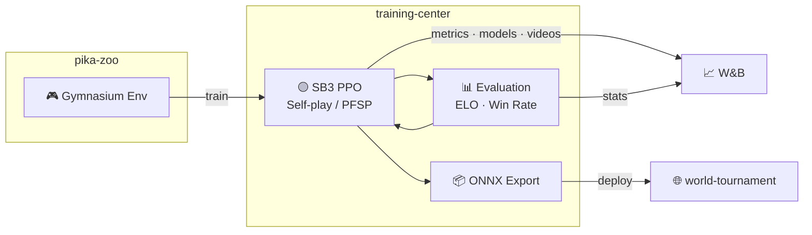

# training-center

[](https://www.python.org/)

RL training pipeline for [alphachu-volleyball](https://github.com/alphachu-volleyball) — self-play, evaluation, and model export.

## Overview

Trains Pikachu Volleyball AI agents using [pika-zoo](https://github.com/alphachu-volleyball/pika-zoo) environments with [Stable-Baselines3](https://stable-baselines3.readthedocs.io/) PPO.

- **Training**: PPO with cross-play and PFSP (Prioritized Fictitious Play)
- **Evaluation**: ELO rating (batch Bradley-Terry MLE) and win-rate tracking
- **Export**: ONNX models for browser-based play in [world-tournament](https://github.com/alphachu-volleyball/world-tournament)

### Pipeline



## Quick Start

```bash
# Install
uv sync

# Run tests
uv run pytest

# Lint
uv run ruff check .
```

## Usage

```bash
# Baseline PPO training (vs builtin AI)
uv run train-baseline --opponent builtin --timesteps 1000000

# Cross-play training with PFSP
uv run train-crossplay --total-iterations 100 --steps-per-iter 20000 --save-dir experiments/001

# Curriculum training (progressive difficulty)
uv run train-curriculum --save-dir experiments/010 --total-iterations 200

# Round-robin ELO evaluation (p1 pool × p2 pool)
uv run evaluate-roundrobin --p1 random,builtin,experiments/001/model --p2 random,builtin,experiments/003/model --games 50

# Compute ELO from existing matchup results (CSV or W&B table JSON)
uv run compute-elo matchups.csv --p1 p1 --p2 p2 --win-rate p1_win_rate --games 100
uv run compute-elo matchups.table.json --p1 p1 --p2 p2 --p1-wins p1_wins --p2-wins p2_wins -o elo.csv
```

## Training Scripts

### `train-baseline` — Fixed-opponent PPO training

Trains a single agent against a fixed rule-based opponent (random, builtin, stone, duckll). The simplest training mode — useful for bootstrapping a policy before cross-play.

**Process:**

1. Create `SubprocVecEnv` with N parallel environments, each running the fixed opponent
2. Initialize PPO (or resume from `--init-model`)
3. `model.learn()` runs continuously for `--timesteps` steps
4. `EvalCallback` fires every `--eval-freq` steps:
   - Saves a checkpoint to disk
   - Evaluates against each opponent in parallel (`ProcessPoolExecutor`)
   - Computes ELO, win rate, detailed metrics → logs to W&B
5. Saves final model + records sample videos

**Key design decisions:**

- **SubprocVecEnv** — opponent is fixed, so env parallelization works directly. Each child process runs its own env + opponent independently. This is where multicore CPU gives linear speedup.
- **Parallel eval callback** — evaluation matchups are submitted to a `ProcessPoolExecutor` so multiple opponents can be evaluated simultaneously. Models are passed as file paths; workers reconstruct them to avoid pickling issues.
- **SB3 callback-driven eval** — evaluation runs inside the training loop via `EvalCallback`. Training pauses during eval, but parallel execution minimizes the pause.

### `train-crossplay` — PFSP cross-play training

Alternately trains two separate agents (p1 left, p2 right) against each other and a pool of past checkpoints, using PFSP (Prioritized Fictitious Play).

**Process:**

1. Create `DummyVecEnv` for both p1 and p2 (opponent must be swappable in-place)
2. Initialize two PPO models
3. For each iteration:
   - **Evaluate** (every `--eval-freq` iters): 5 matchups + PFSP pool stats, all in parallel via `ProcessPoolExecutor`
   - **Save** checkpoint to opponent pool (every `--save-interval` iters)
   - **Train p1**: sample opponent from p2 pool (PFSP) or anchor AI, swap opponent policy, `model.learn(steps_per_iter)`
   - **Train p2**: same against p1 pool
4. Saves final models + records sample videos

**Key design decisions:**

- **DummyVecEnv** (not SubprocVecEnv) — cross-play requires swapping the opponent policy every iteration via `set_opponent_policy()`, which directly modifies the env's internal state. This requires same-process access (`vec_env.envs[i]`), which SubprocVecEnv doesn't allow. We benchmarked a custom SubprocVecEnv with pipe-based opponent swap, but the lightweight env (low-dim vector physics) made pipe serialization overhead comparable to parallelism gains (~6% improvement), so DummyVecEnv remains the better tradeoff.
- **Parallel evaluation** — the evaluation phase (matchups + PFSP pool stats) is fully parallelized with `ProcessPoolExecutor`. Workers receive model paths, reconstruct players internally, and return serializable results. This avoids the main bottleneck as pools grow (20+ checkpoints × 10 games each).
- **PFSP opponent sampling** — opponents are sampled with probability inversely proportional to win rate against them (weaker opponents get played more). `pool.update_stats()` runs in the main process after collecting parallel results to maintain consistent state.
- **Anchor + pool curriculum** — a configurable mix of rule-based anchor AI and pool opponents. Supports fixed ratio, schedule-based, and adaptive (win-rate-based) curricula.

### `train-curriculum` — Progressive difficulty curriculum training

Trains a single agent against a ladder of increasingly difficult rule-based AIs. Opponents are unlocked as the model masters the current pool.

**Process:**

1. Create `DummyVecEnv` (opponent swapping requires in-process access)
2. Initialize PPO with first few opponents unlocked (stone, random, duckll:1)
3. For each iteration:
   - **Evaluate** (every `--eval-freq` iters): play against all unlocked opponents in parallel
   - **Unlock**: if min win rate across pool >= `--unlock-threshold`, unlock next opponent
   - **Train**: PFSP-sample an opponent from unlocked pool, swap policy, `model.learn(steps_per_iter)`
4. Saves final model + records sample videos vs all unlocked opponents

**Key design decisions:**

- **CurriculumPool** (not OpponentPool) — manages named AI specs (strings) instead of model checkpoint files. Uses same PFSP weighting formula (`1.0 - win_rate + 0.1`).
- **Unlock-gated ladder** — opponents are ordered by ELO from experiment 009. Only unlocked when all current opponents are mastered. Prevents premature exposure to opponents the model can't learn from.
- **No ELO tracking** — pool composition changes on unlock, making ELO scale unstable. Use `evaluate-roundrobin` after training for absolute ELO measurement.
- **DummyVecEnv** — same reasoning as crossplay: opponent swapping via `set_opponent_policy()`.

### `evaluate-roundrobin` — Round-robin ELO evaluation

Standalone evaluation script for comparing any set of models/AIs in a round-robin format.

**Process:**

1. Build cross-product of p1 pool × p2 pool (including self-matchups)
2. Pre-generate all game seeds for deterministic reproducibility
3. Submit all games to `ProcessPoolExecutor` at once
4. Collect results, compute per-matchup stats and ELO ratings (batch Bradley-Terry MLE)
5. Log as `wandb.Table` for sweep-level comparison

**Key design decisions:**

- **Maximum parallelism** — all games across all matchups are submitted as individual tasks. With hundreds of games and 8+ cores, this gives near-linear speedup.
- **Path-based worker pattern** — workers receive string specs (`"builtin"`, `"duckll:5"`, or model paths), reconstruct `Player` objects internally. This avoids pickling AIPolicy/PPO objects across process boundaries.
- **Deterministic seeding** — seeds are pre-generated from a single RNG in the main process before any parallel execution, ensuring reproducible results regardless of worker scheduling order.

### Common Patterns

All three scripts share these conventions:

| Pattern | How |
|---------|-----|
| Model serialization | Pass file paths to workers, `PPO.load()` / `make_player()` inside child process |
| Eval parallelism | `ProcessPoolExecutor` + `as_completed`, results collected in main process |
| Metrics computation | `compute_eval_metrics()` runs inside worker to avoid serializing frame data |
| W&B logging | Always in main process (W&B run is not fork-safe) |
| Reproducibility | Pre-generate seeds from a single RNG, pass to workers |

## Experiment Tracking

Each training run automatically records git commit hash and pika-zoo version to [W&B](https://wandb.ai/) for reproducibility.

```bash
# First time: log in to W&B (requires API key from https://wandb.ai/authorize)
uv run wandb login

# Runs are logged to --wandb-entity / --wandb-project (defaults: ootzk / alphachu-volleyball)
# To log to your own workspace:
uv run train-baseline --wandb-entity your-entity --wandb-project your-project ...

# Optionally name your run:
uv run train-baseline --wandb-run-name 001-baseline-p1-builtin ...
```

### Tracked Metrics

**round** = serve → score (1 point), **game** = first to winning_score (multiple rounds)

> [!IMPORTANT]
> All models are evaluated on their **training side**. `SimplifyObservation` mirrors player_2's x-axis so both sides see a left-side perspective, but the underlying physics engine has [intentional left-right asymmetries](https://github.com/alphachu-volleyball/pika-zoo#physics-engine-left-right-asymmetry) that make cross-side transfer imperfect. The evaluate script takes separate `--p1`/`--p2` pools to ensure correct placement.

#### Evaluation Metrics (`eval/vs_{opp}/`)

Shared across all training scripts. Logged every `--eval-freq` steps/iterations.
`{opp}`: `random`, `builtin`, `stone`, `duckll:N`, `p2`/`p1` (crossplay only)

| Metric | Range | Description |
|--------|-------|-------------|
| `eval/vs_{opp}/win_rate` | 0–1 | Win rate over eval games |
| `eval/vs_{opp}/avg_score` | 0–5 | Average model score per game |
| `eval/vs_{opp}/serve_win_rate` | 0–1 | Scoring rate when model serves |
| `eval/vs_{opp}/receive_win_rate` | 0–1 | Scoring rate when opponent serves |
| `eval/vs_{opp}/avg_round_frames` | > 0 | Mean frames per round (25 FPS) |
| `eval/vs_{opp}/std_round_frames` | ≥ 0 | Std of round duration (low = repetitive pattern) |
| `eval/vs_{opp}/action_entropy` | 0–log₂18 | Shannon entropy of action distribution |
| `eval/vs_{opp}/power_hit_rate` | 0–1 | Power hits / ball touches |
| `eval/vs_{opp}/ball_own_side_ratio` | 0–1 | Fraction of frames ball is on model's court half |
| `eval/vs_{opp}/serve_avg_round_frames` | > 0 | Mean round frames when model serves |
| `eval/vs_{opp}/receive_avg_round_frames` | > 0 | Mean round frames when opponent serves |
| `eval/elo` | varies | ELO rating via batch Bradley-Terry MLE (1500 = geometric mean) |

Crossplay prefixes eval keys with `p1/` or `p2/` (e.g. `p1/eval/vs_builtin/win_rate`).

#### Script-specific Metrics

| Metric | Script | Timing | Description |
|--------|--------|--------|-------------|
| `{p1,p2}/pfsp/avg_pool_win_rate` | crossplay | eval_freq | Average win rate against PFSP pool |
| `{p1,p2}/pfsp/min_win_rate` | crossplay | eval_freq | Lowest win rate in pool |
| `{p1,p2}/pfsp/pool_size` | crossplay | eval_freq | Number of checkpoints in opponent pool |
| `{p1,p2}/curriculum/anchor_prob` | crossplay | every iteration | Anchor AI sampling probability |
| `{p1,p2}/curriculum/pool_prob` | crossplay | every iteration | Pool sampling probability |
| `curriculum/pool_size` | curriculum | eval_freq | Number of unlocked opponents |
| `curriculum/min_win_rate` | curriculum | eval_freq | Lowest win rate across unlocked pool |
| `curriculum/avg_win_rate` | curriculum | eval_freq | Average win rate across unlocked pool |

#### Training Metrics (SB3 PPO)

Logged every iteration (after `model.learn()`). Crossplay prefixes with `p1/` or `p2/`.

| Metric | Description |
|--------|-------------|
| `train/loss` | PPO total loss |
| `train/entropy_loss` | Policy entropy (lower = more deterministic) |
| `train/explained_variance` | Value function accuracy (1.0 = perfect) |
| `train/approx_kl` | KL divergence between old and new policy |

#### One-time Outputs

| Metric | Script | Description |
|--------|--------|-------------|
| `video/vs_{opp}` | all training | Sample game recording at end of training |
| `matchups` (Table) | evaluate-roundrobin | Per-matchup win rates and stats |
| `elo_ratings` (Table) | evaluate-roundrobin | Batch Bradley-Terry ELO ratings |
| `elo/{agent}` (summary) | evaluate-roundrobin | ELO per agent in run summary |

#### Run Config (auto-recorded)

| Field | Description |
|-------|-------------|
| `commit` | Git HEAD hash |
| `dirty` | Uncommitted changes exist |
| `pika_zoo_version` | Pinned pika-zoo version |

## W&B MCP Server (Claude Code Integration)

Claude Code can query W&B experiment data directly via the [wandb-mcp-server](https://github.com/wandb/wandb-mcp-server). Create `.mcp.json` in the project root:

```json
{
  "mcpServers": {
    "wandb": {
      "command": "uvx",
      "args": [
        "--from",
        "git+https://github.com/wandb/wandb-mcp-server.git",
        "wandb_mcp_server"
      ],
      "env": {
        "WANDB_API_KEY": "<your-api-key>"
      }
    }
  }
}
```

Get your API key from https://wandb.ai/authorize.

## Experiment Tips: Cross-machine sync

`experiments/` can be a symlink to a cloud-synced folder (Dropbox, Google Drive, etc.) for sharing experiment data across machines. See [CLAUDE.md](CLAUDE.md#experiments-directory) for setup.

> [!NOTE]
> `experiments/` is gitignored because it contains large model files, temporary outputs, and ad-hoc scripts that change frequently during experimentation.

## Development

See [CLAUDE.md](CLAUDE.md) for the full development guide, including experiment conventions and lessons learned.

### Branch Workflow

```
feat/* ──(squash)──► main
```

## Related Projects

- [alphachu-volleyball/pika-zoo](https://github.com/alphachu-volleyball/pika-zoo) — Pikachu Volleyball RL environment
- [alphachu-volleyball/world-tournament](https://github.com/alphachu-volleyball/world-tournament) — Web demo (planned)
